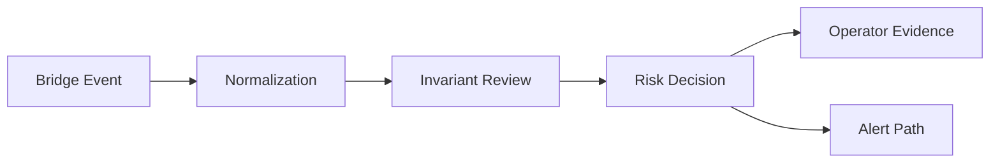

# Public Architecture

BridgeGuard can be understood as a defensive decision loop:

1. Observe bridge-related events from approved data sources.
2. Normalize events into a common defensive review format.
3. Evaluate runtime invariants and scenario signals.
4. Produce an explainable decision for operators.
5. Preserve evidence for review, reporting, and continuous improvement.

This diagram is intentionally high level. It does not include deployable service topology, database design, connector internals, queue configuration, authentication flow, or proprietary scoring logic.
